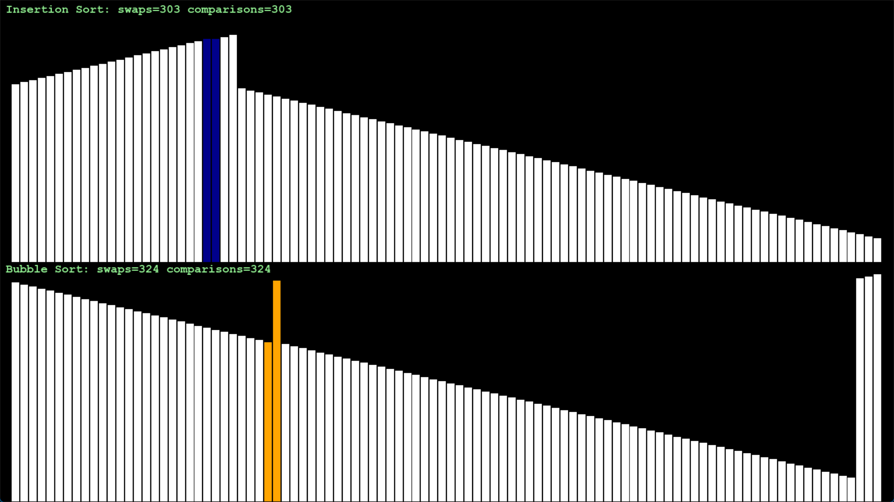

# Sorting Algorithm Visualizer 🎨✨

This project visualizes two popular sorting algorithms:
- Bubble Sort
- Insertion Sort

The visualization is built using Python and Pygame.

## 📂 Files

- `sorting_visualizer.py`: Contains the complete simulation of sorting and visualization.

## 📷 Demo

<div align="center">
    
    <p><em> Sort and Insertion Sort running side by side!</em><p>
</div>

<!--  -->

## 📜 Requirements

- Python 3.8+
- Pygame
- Numpy

Install the dependencies:

```bash
pip install pygame numpy
```